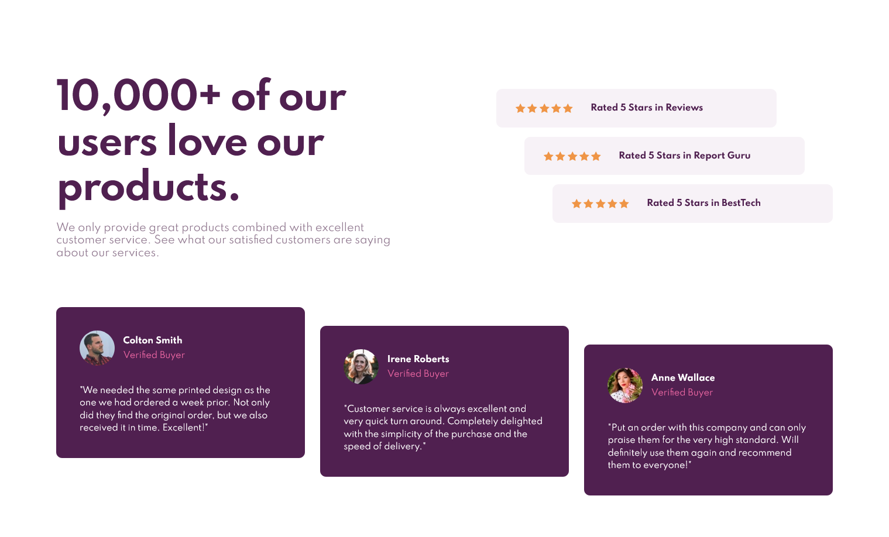
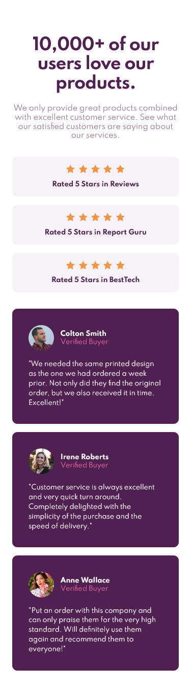

# Frontend Mentor - Social proof section solution

This is a solution to the [Social proof section challenge on Frontend Mentor](https://www.frontendmentor.io/challenges/social-proof-section-6e0qTv_bA). Frontend Mentor challenges help you improve your coding skills by building realistic projects.

## Table of contents

- [Overview](#overview)
  - [The challenge](#the-challenge)
  - [Screenshot](#screenshot)
  - [Links](#links)
- [My process](#my-process)
  - [Built with](#built-with)
  - [What I learned](#what-i-learned)
  - [Continued development](#continued-development)
  - [Useful resources](#useful-resources)
- [Author](#author)
- [Acknowledgments](#acknowledgments)

**Note: Delete this note and update the table of contents based on what sections you keep.**

## Overview

### The challenge

Users should be able to:

- View the optimal layout for the section depending on their device's screen size

### Screenshot

### Links

- Solution URL: [Final Solution](https://www.frontendmentor.io/solutions/social-proof-section-using-sass-and-animation-hTS_RbhgB)
- Live Site URL: [Live Preview](https://lordaldi.github.io/SocialProofSection-FrontEndMaster/)

## My process

### Built with

- Semantic HTML5 markup
- CSS custom properties
- Flexbox
- CSS Grid
- Mobile-first workflow
- [Sass](https://sass-lang.com/) - Sass

### Continued development

for next i planing to add more simple animation and learn about keyframes

### Useful resources

- [w3school](https://www.w3schools.com/) - This helped me for guide with html, help to change pic when size change, etc.
- [flexbox malven](https://flexbox.malven.co/) - This is an amazing guide for referance when using flexboc. I'd recommend it to anyone still learning this concept.
- [grid malven](https://grid.malven.co/) - This is an amazing guide for referance when using grid. I'd recommend it to anyone still learning this concept.
- [css-trick](https://css-tricks.com/) - best article about css
- [Sass doc](https://sass-lang.com/) - for learning Sass

## Author

- Website - [Aldi Anugra](https://github.com/LordAldi)
- Frontend Mentor - [@LordAldi](https://www.frontendmentor.io/profile/LordAldi)
- Instgram - [@aldi_anu](https://www.instagram.com/aldi_anu/)
- LinkedIn - [Aldi Anugra](https://www.linkedin.com/in/aldi-anugra-333132199/)
